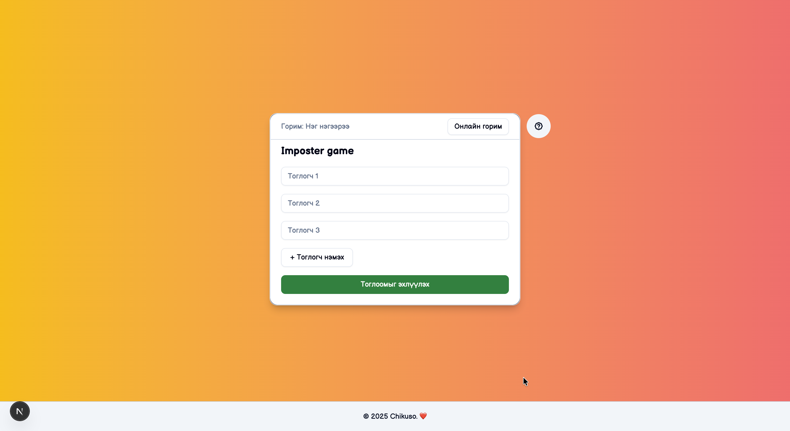

# 🎭 Word Imposter

**Word Imposter** is a fun social word game inspired by _Among Us_.  
Each player receives a secret word — except one player, the **Imposter**, who gets a different word (or none at all).

Discuss, observe carefully, and figure out who the Imposter is!



---

## 🚀 Features

### 🎮 Game Modes

-   **Local Mode** – Play on a single device by passing it around
-   **Online Mode** – _(Planned for future development)_

### ✨ Highlights

-   👥 Supports **3–10 players**
-   🎯 Automatic role assignment (Imposter / Player)
-   🎲 Random word selection
-   🧠 Turn-based gameplay
-   🌙 Dark / Light mode toggle
-   📱 Fully responsive (mobile-friendly)
-   ✨ Smooth animations with **Framer Motion**

---

## 🛠 Tech Stack

-   **Next.js 14 (App Router)** – React framework with server-side rendering
-   **TypeScript** – Type-safe development
-   **Tailwind CSS** – Utility-first styling
-   **Framer Motion** – Smooth animations and transitions
-   **React Context API + Reducer** – State management
-   **shadcn/ui** – High-quality UI components

---

## 📁 Project Structure

```
word-imposter/
├── public/                 # Static assets
├── src/
│   ├── app/                # Next.js App Router
│   │   ├── game/
│   │   │   ├── local/      # Local game mode
│   │   │   └── online/     # Online game mode (coming soon)
│   │   ├── layout.tsx
│   │   ├── page.tsx
│   │   └── globals.css
│   │
│   ├── components/         # Reusable UI components
│   │   ├── ui/             # shadcn/ui components
│   │   ├── Footer.tsx
│   │   ├── ModalComp.tsx
│   │   ├── ModeToggle.tsx
│   │   ├── PlayerSetup.tsx
│   │   ├── PlayPhaseControls.tsx
│   │   └── ShowWordScreen.tsx
│   │
│   ├── context/            # Global game state
│   │   ├── GameContext.tsx
│   │   └── gameReducer.ts
│   │
│   ├── engine/             # Core game logic
│   │   ├── assignRoles.ts
│   │   ├── getCurrentPlayer.ts
│   │   ├── getRandomWord.ts
│   │   └── words.ts
│   │
│   ├── types/              # Type definitions
│   │   └── game.ts
│   │
│   └── lib/
│       └── utils.ts
│
├── tailwind.config.ts
├── next.config.ts
├── package.json
└── README.md
```

---

## ⚙️ Getting Started

### Prerequisites

-   Node.js 16+ and npm (or yarn/pnpm)

### Installation

**1. Clone the repository**

```bash
git clone https://github.com/your-username/word-imposter.git
cd word-imposter
```

**2. Install dependencies**

```bash
npm install
```

**3. Start the development server**

```bash
npm run dev
```

Open your browser and visit:

```
http://localhost:3000
```

### Build for Production

```bash
npm run build
npm run start
```

---

## 🧠 How the Game Works

### Game Phases

1. **Setup Phase** – Players are assigned roles (Imposter or Player)
2. **Show Word Phase** – Each player sees their secret word privately
3. **Play Phase** – Players discuss and take turns speaking
4. **Voting Phase** – Players vote to eliminate the suspected Imposter

### Core Game Logic

**assignRoles.ts**

-   Randomly selects one player as the Imposter
-   Assigns the remaining players as regular Players

**getRandomWord.ts**

-   Selects a random word from the word list
-   Imposter may receive a different word or no word at all

**GameContext + Reducer**

-   Manages global game state and phase transitions
-   Handles player turn management
-   Stores game configuration and results

**ShowWordScreen**

-   Displays the secret word to each player individually
-   Ensures privacy with clear handoff between turns

---

## 🎨 UI & Animations

### Framer Motion

-   Smooth modal open/close animations
-   Interactive hover and tap effects
-   Elegant transitions between game phases

### Tailwind CSS

-   Responsive design (mobile-first)
-   Gradient backgrounds for visual appeal
-   Dark/Light theme support with theme toggle

### Dark Mode

Click the moon/sun icon in the header to toggle between dark and light themes.

---

## 🌐 Online Mode (Coming Soon)

The online multiplayer mode is currently under development. Planned features include:

-   Real-time multiplayer gameplay
-   Voting system with player elimination
-   Host-controlled game rooms
-   Game timers and round management
-   Chat functionality
-   Player rankings and statistics

---

## 🔮 Future Improvements

-   🌐 Online multiplayer (WebSockets / Firebase)
-   🗳 Voting & elimination phase
-   ⏱ Timers and round limits
-   🧑‍⚖️ Host / moderator role
-   🌍 Multi-language support
-   📊 Game statistics and leaderboards
-   🎨 Additional themes and customization
-   🔐 Secure game rooms with invite codes

---

## 📖 Game Rules

1. **Setup**: Select 3–10 players and start the game
2. **Word Reveal**: Each player sees their secret word (except the Imposter)
3. **Discussion**: Players take turns describing their word without revealing it
4. **Deduction**: Based on descriptions, players guess who the Imposter is
5. **Voting**: Players vote to eliminate a suspect
6. **Result**: The Imposter is revealed, and the game concludes

---

## 🤝 Contributing

Contributions are welcome! To contribute:

1. Fork the repository
2. Create a feature branch (`git checkout -b feature/amazing-feature`)
3. Commit your changes (`git commit -m 'Add amazing feature'`)
4. Push to the branch (`git push origin feature/amazing-feature`)
5. Open a Pull Request

---

## 📄 License

This project is licensed under the **MIT License** – see the [LICENSE](LICENSE) file for details.

You are free to use, modify, and distribute this project, provided you include the license notice.

---

## 👨‍💻 Author

**Chikuso**  
Software Engineer / IT Student

This project was built to practice:

-   Modern React patterns and hooks
-   Next.js App Router and file-based routing
-   State management with Context API & Reducers
-   UI animation and microinteractions
-   Responsive web design
-   TypeScript for type safety

---

## 📞 Support

If you encounter any issues or have suggestions, please:

-   Open an [Issue](https://github.com/your-username/word-imposter/issues)
-   Start a [Discussion](https://github.com/your-username/word-imposter/discussions)

---

## 🙏 Acknowledgments

-   Inspired by the social deduction game _Among Us_
-   Built with amazing open-source tools and libraries
-   Thanks to all contributors and testers!

---

**Made with ❤️ by Chikuso**
